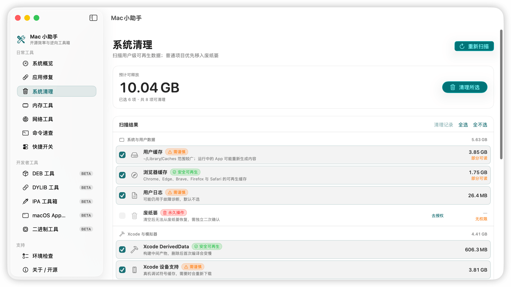
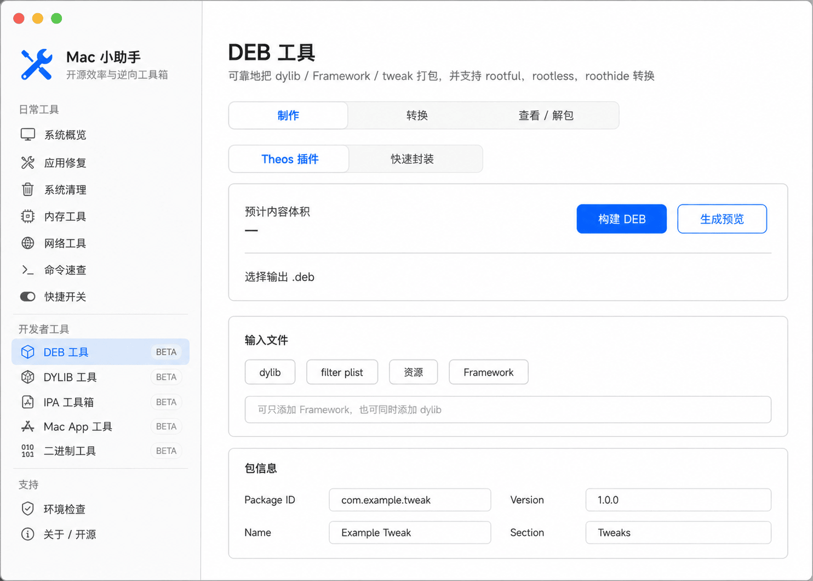
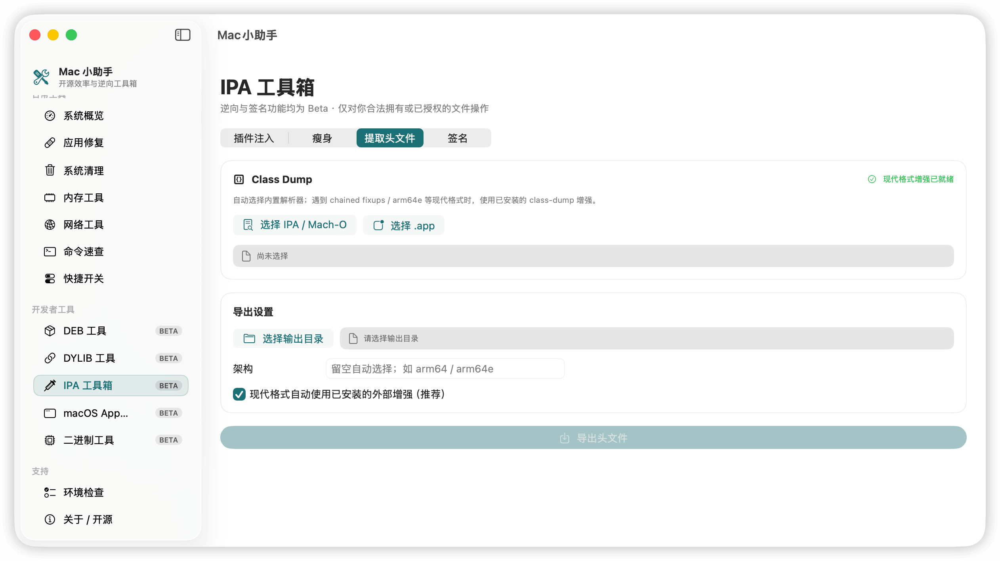
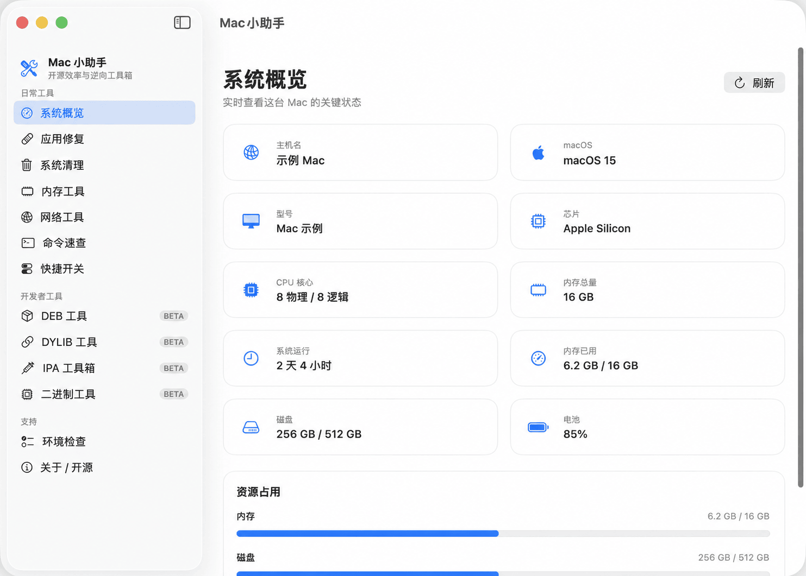

<p align="center">
  
</p>

<p align="center">
  <a href="docs/README.zh-CN.md">简体中文</a> ·
  <a href="docs/README.es.md">Español</a> ·
  <a href="docs/README.ko.md">한국어</a> ·
  <a href="docs/README.ru.md">Русский</a>
</p>

<p align="center">
  <a href="https://github.com/iosrxwy/MacAssistant/actions/workflows/ci.yml"></a>
  
  
  <a href="LICENSE"></a>
  <a href="https://github.com/iosrxwy/MacAssistant/stargazers"></a>
</p>

<h1 align="center">MacAssistant</h1>

<p align="center">
  <strong>One native Mac app for system care and Apple-binary work.</strong><br>
  Replace scattered scripts and terminal lookups with clear, previewable workflows.
</p>

## Why MacAssistant

| Everyday Mac tools | Apple developer workflows | Built for confidence |
| --- | --- | --- |
| See system health, reclaim space, repair apps and inspect memory or network state. | Build DEB packages, inspect DYLIBs, process IPAs, edit Mach-O files and manage signing. | Preview-first actions, explicit confirmation, open source and no telemetry. |

## What’s inside

### Daily toolkit

- **System overview** — chip, memory, disk, battery and uptime at a glance
- **Safe cleanup** — caches, logs, Xcode data and other regenerable files
- **App repair** — diagnose signatures, quarantine attributes and launch issues
- **Memory & network** — pressure, processes, ports, ping, DNS and public IP
- **Command library** — 262 searchable macOS commands with risk labels

### Developer toolkit · Beta

- **DEB** — create, inspect, unpack, convert and rebuild packages
- **DYLIB** — inspect dependencies, extract libraries and rewrite install names or rpaths
- **IPA** — drag-in workbench, install and extract (as-is, no FairPlay dump), optional App Store download via local `ipatool` (own Apple ID, still encrypted), injection, thinning, header extraction, layered signing, and Apple ID signing
- **Mach-O** — native Swift inspection and dylib injection for thin or universal binaries
- **Environment check** — find required tools and get guided setup actions

## Screenshots

<p align="center">
  
  
</p>

<p align="center">
  
  
</p>

## Download

Get the universal Apple Silicon + Intel build from [Releases](https://github.com/iosrxwy/MacAssistant/releases).

> Requires macOS 13 or later. Developer tools are Beta; keep a backup before modifying files.

### First launch blocked by macOS?

This public beta is an **ad-hoc development build. Apple has not notarized it.** The first open may show “Apple cannot verify this app” or get blocked. That is expected, not a broken download.

1. Try to open the app once (macOS will block it; that is normal).
2. Open **System Settings → Privacy & Security**.
3. Scroll to the message about this app and click **Open Anyway**.
4. Open the app again.

Do not turn Gatekeeper off globally. If the button is missing, wait a minute and check that section again — it usually appears after the first blocked launch.

## Build

```bash
git clone https://github.com/iosrxwy/MacAssistant.git
cd MacAssistant
./build_app.sh release universal
open "dist/Mac小助手.app"
```

## Contributing

- **Issue** — bugs, ideas, and usage questions. Use the form; do not open an empty PR to report a problem.
- **Pull request** — code or docs you want merged. CI (`build`) must pass.
- Scope and “will not accept” list: [CONTRIBUTING.md](CONTRIBUTING.md). Security reports: [SECURITY.md](SECURITY.md).

## Stars & Contributors

<p align="center">
  <a href="https://github.com/iosrxwy/MacAssistant/stargazers"></a><br>
  
</p>

<p align="center">
  <a href="https://star-history.com/#iosrxwy/MacAssistant&Date">
    <picture>
      <source media="(prefers-color-scheme: dark)" srcset="https://api.star-history.com/svg?repos=iosrxwy/MacAssistant&type=Date&theme=dark">
      <source media="(prefers-color-scheme: light)" srcset="https://api.star-history.com/svg?repos=iosrxwy/MacAssistant&type=Date">
      
    </picture>
  </a>
</p>

<p align="center">If MacAssistant saves you time, a star helps more people discover it.</p>

<table>
  <tr>
    <td align="center" valign="top" width="140">
      <a href="https://github.com/iosrxwy">
        
      </a><br>
      <a href="https://github.com/iosrxwy"><b>iosrxwy</b></a><br>
      <sub>Author</sub>
    </td>
    <td align="center" valign="top" width="140">
      <a href="https://github.com/codex">
        
      </a><br>
      <a href="https://github.com/codex"><b>Codex</b></a><br>
      <sub>Development</sub>
    </td>
    <td align="center" valign="top" width="140">
      <a href="https://x.ai/grok">
        
      </a><br>
      <a href="https://x.ai/grok"><b>Grok Build</b></a><br>
      <sub>Development</sub>
    </td>
  </tr>
</table>

## Credits

Developed and maintained by **Codex** · Published by [iosrxwy](https://github.com/iosrxwy).

Special thanks to these open-source projects (none of their binaries are bundled):

- [AltSign](https://github.com/rileytestut/AltSign) / [AltStore](https://github.com/altstoreio/AltStore) — Apple ID developer-service protocol reference (Riley Testut)
- [xtool](https://github.com/xtool-org/xtool) — optional Apple ID CLI
- [libimobiledevice](https://libimobiledevice.org) — USB device listing and install
- [Theos](https://github.com/theos/theos) — tweak project build environment
- [zsign](https://github.com/zhlynn/zsign) — optional IPA / Mach-O signing tool
- [ipatool](https://github.com/majd/ipatool) — optional App Store IPA download (MIT; not bundled)

## License

[GNU GPL-3.0](LICENSE). Distributed modifications must remain free software under the same license, with complete corresponding source. This does not by itself authorize bundling other projects: `class-dump` is also GPL-3.0 and could be combined only together with its corresponding source; `dsdump` has no clear license and must not be redistributed; AltStore / AltSign are AGPL-3.0 and are referenced as protocol documentation only.
